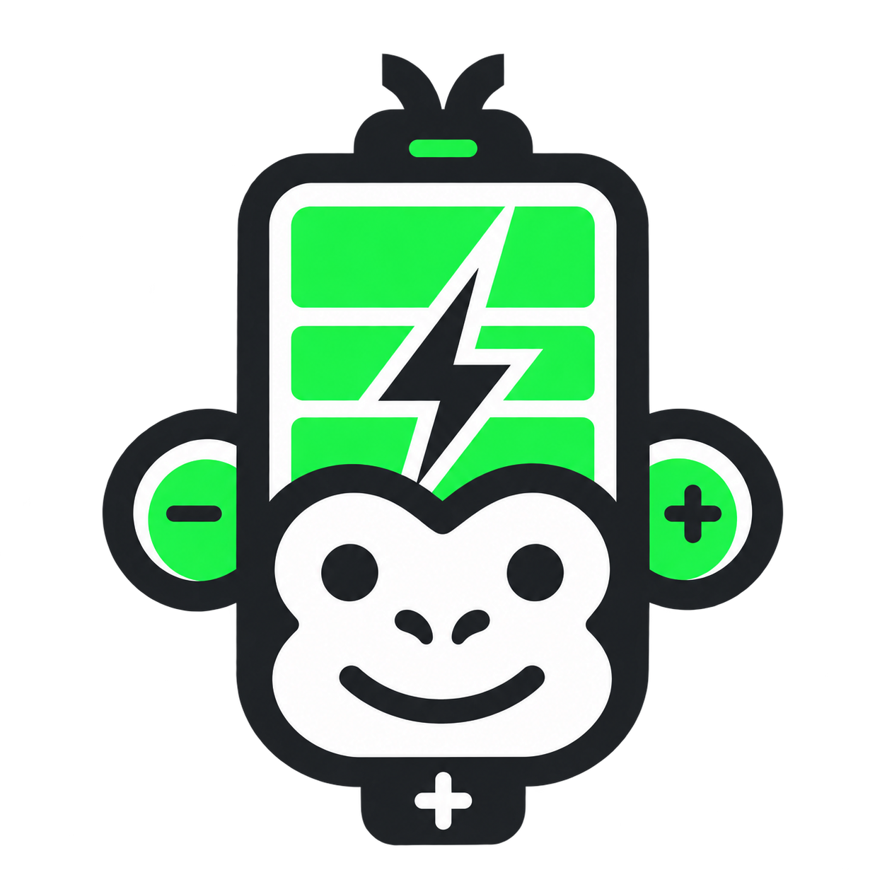

<p align="center"></p>

# Akku

**Tu batería, entendida a partir de tu rutina diaria.** Un compañero nativo y experimental para MacBook Air y Pro con Apple Silicon M1–M5.

[English](../../README.md) · [Español](README.es.md) · [Français](README.fr.md) · [简体中文](README.zh-Hans.md) · [Deutsch](README.de.md) · [Português (Brasil)](README.pt-BR.md)

[Descargar](https://github.com/Francoocicchetti/Akku/releases) · [Feedback e ideas](https://github.com/Francoocicchetti/Akku/discussions) · [Informar un problema](https://github.com/Francoocicchetti/Akku/issues/new/choose)

## Por qué hice Akku

Soy hispanohablante y no soy programador. Hice Akku con ayuda de herramientas de IA porque quería cuidar mi MacBook y entender mejor su batería: cuánto dura con mi rutina, dónde suelo cargar y cuándo conviene llevar el cargador.

Esto nació por la salud de mi propio MacBook. Quería una app que aprendiera del uso diario, sin obligarme a escribir todo lo que hago. Akku también es el mono que te acompaña: con energía, con sueño, con hambre de electricidad o recordándote discretamente que hagas una pausa.

**Es un proyecto personal y experimental. Puede contener fallas, estimaciones incorrectas y comportamientos que todavía necesitan trabajo.** No afirmo tener experiencia profesional programando ni haber probado todos los MacBook. Lo publico para que otras personas puedan usarlo, revisar cómo funciona y ayudar a mejorarlo. No repara la batería ni demuestra que vaya a prolongar su vida útil.

Como mi idioma es el español, **puede que algunas traducciones estén medio malas**, incluso la documentación en inglés. Si encuentras algo raro, una corrección es bienvenida. Puedes dejar feedback en cualquiera de los seis idiomas disponibles.

## Compatibilidad e idiomas

- Por ahora, esta versión está destinada **solo a MacBook Air y MacBook Pro con M1, M2, M3, M4 o M5**, incluidas las variantes Pro/Max correspondientes.
- Prueba física realizada: **un MacBook Air M5**. Reconocer un modelo no equivale a validar todas sus configuraciones.
- macOS 13 o posterior, respetando la versión mínima que requiera cada Mac. Sigue pendiente la validación física en versiones anteriores compatibles de macOS.
- Intel, Mac de escritorio, MacBook Neo, Windows y Linux quedan fuera del soporte actual. Que el script pueda compilar una versión Intel no significa que tenga soporte anunciado.
- La instalación nueva empieza en inglés. Puedes cambiar a español, francés, chino simplificado, alemán o portugués de Brasil desde la cabecera o Ajustes. La elección se conserva.

## Qué hace la app

### Una carga completa, tu rutina

Estima **cuánto duraría una batería del 100% al 0% con la combinación de usos observada en los últimos siete días**. La pantalla principal no pide elegir actividades ni introducir horas.

Usa la caída real del porcentaje dividida por el tiempo observado con batería y el Mac despierto. Excluye carga, reposo e interrupciones. Esta estimación no descuenta la reserva de seguridad ni toma el porcentaje actual como si fuera una carga completa.

Para empezar necesita tres días observados, diez minutos como mínimo en cada uno, noventa minutos acumulados y cinco puntos de batería consumidos. Hasta entonces muestra el avance del aprendizaje. Entrega un rango y confianza, amplía el margen cuando los días son distintos y limita la confianza de rutina a media mientras falta calibración real. Otra carga de trabajo, accesorios o condiciones pueden cambiar el resultado.

### Registro automático e historial

Desconectar el cargador inicia el registro. Si abres Akku cuando ya usas batería, observa desde ese momento. Una salida de casa confirmada también puede iniciar una sesión. No hay botón de escaneo. Estar conectado con la carga optimizada en pausa no se confunde con desconectarse.

El reposo y los huecos no cuentan; al despertar se reanuda. Una conexión estable durante un minuto termina la sesión. Akku debe estar abierta para aprender. Abrir al iniciar sesión es opcional y apagar el aprendizaje detiene el registro.

Estadísticas muestra la semana, sesiones, puntos consumidos y tiempo en casa, fuera o sin ubicación. El panel de batería incluye **24 horas y 10 días**, nivel, períodos de carga/conexión, pantalla encendida observada y consulta de intervalos. No inventa el historial que falta. Pantalla encendida no equivale a atención y los puntos consumidos pueden superar 100 tras varias recargas.

### Apps reales y combinaciones

Reconoce aplicaciones abiertas mediante macOS: Safari, FaceTime, ChatGPT, WhatsApp y otras apps con interfaz. Muestra sus iconos y separa tiempo abiertas de uso en primer plano, con resúmenes diarios y por lugar.

Aprende el consumo del Mac completo mientras hay ciertas combinaciones abiertas. **CPU no es energía exacta por app.** Tener FaceTime abierto no demuestra una llamada; una página dentro de Safari aparece como Safari. No lee mensajes, documentos, pestañas, pantalla ni teclas. Las llamadas de fondo y la lectura sin interacción pueden quedar subestimadas.

### Lugares, mapa y regreso a casa

El mapa interactivo de Apple MapKit muestra lugares frecuentes, cargas observadas, episodios de batería baja y patrones de uso en 7 o 30 días. Seleccionar un lugar permite consultar sus apps e historial. Puede sugerir casa o trabajo tras observaciones repetidas; tú confirmas qué significa cada lugar.

La ubicación automática requiere permiso de macOS y puede desactivarse. La batería sigue aprendiendo sin ella. Puedes introducir lugares o una posición actual manual: esta dura treinta minutos y no se presenta como una salida detectada. Buscar direcciones consulta Apple Maps cuando pulsas Buscar.

«¿Has salido?» es discreto y aparece tras un cambio confirmado. La detección no es inmediata ni infalible. La distancia a casa es **en línea recta; no es una ruta ni un tiempo de viaje**. La recomendación de cargar ahora o al llegar combina batería, reserva y los tiempos de regreso/uso que indiques. No garantiza llegar sin cargar. Akku no reemplaza Buscar ni localiza remotamente un equipo apagado.

### Akku como compañero

El mono tiene ocho estados: listo, lleno, cargando, batería baja, agotado, descanso, noche y fuera de casa. «Alimentar a Akku» significa conectar el cargador real. Usa hora, carga, uso reciente y ubicación permitida; no lo sabe todo ni necesita un servicio remoto de IA.

Se anima al aparecer o cambiar de estado y luego en secuencias breves. Se pausa al ocultarse, con Bajo consumo, Emergencia o Reducir movimiento. Las sugerencias de descanso quedan dentro de la app y se pueden silenciar; son aproximaciones, no mediciones de salud.

### Emergencia y consumo de la app

Emergencia intenta bajar el brillo en pantallas compatibles, reduce las consultas de Akku, muestra lo aplicado y permite deshacerlo. Bajo consumo y las sincronizaciones de otras apps requieren intervención manual. Cerrar otra app pide confirmación y un cierre normal; puede cortar una llamada o subida. Reabrirla no recupera trabajo sin guardar.

No promete una hora extra. Observa aproximadamente cada minuto en segundo plano o cada treinta segundos con la interfaz visible; detiene el temporizador durante el reposo. Agrupa escrituras, consulta CPU cuando hace falta y espacia los reintentos de ubicación. Las animaciones usan ráfagas de ocho fotogramas por segundo. **Consumir poco es un objetivo, no consumo cero ni un resultado demostrado en todos los equipos.**

## Privacidad

No hay cuenta de Akku, analíticas ni servidor del desarrollador. El historial queda en `~/Library/Application Support/BatteryTrip`; se conserva esa identidad antigua para no perder datos previos.

Guarda observaciones de batería, identificadores y uso de apps, coordenadas de lugares y visitas agregadas; no un recorrido continuo. Los mapas, búsqueda de direcciones y Localización de macOS pueden comunicarse con Apple. Sin permiso, dejan de funcionar las funciones de ubicación, no el aprendizaje de batería.

Puedes borrar aprendizaje en Ajustes y lugares en Lugares. Las exportaciones incluyen batería e identificadores de apps, pero omiten coordenadas y asociaciones con lugares. **Revisa y oculta información personal antes de compartirlas.** No publiques tu domicilio, capturas de tu ubicación ni archivos de uso personal en los reportes.

## Instalación y compilación

Descarga el ZIP desde [Releases](https://github.com/Francoocicchetti/Akku/releases), descomprímelo, mueve `Akku.app` a Aplicaciones y ábrela. Sal de la versión anterior antes de reemplazarla. Cerrar la ventana mantiene la app en la barra de menú. No ejecutes dos versiones simultáneamente; las preferencias e historial se conservan.

La versión preliminar tiene **firma local ad hoc; no tiene firma Developer ID ni notarización de Apple**. macOS puede advertir o impedir abrirla. El proyecto no exige desactivar la seguridad del sistema. Puedes revisar y compilar el código; la firma para distribución amplia sigue pendiente.

Necesitas un Mac, Python 3, Xcode/Command Line Tools, un SDK compatible y Swift 5.9 o posterior:

```sh
./test.sh
./build.sh "$PWD/dist"
```

No hay paquetes externos. `notarize.sh` requiere un certificado Developer ID y un perfil propio del llavero; aquí no se incluyen credenciales.

## Feedback y ayuda

Usa [Discussions](https://github.com/Francoocicchetti/Akku/discussions) para contar tu experiencia, proponer ideas o preguntar. Para fallas, consumo y traducciones, usa los [formularios por idioma](https://github.com/Francoocicchetti/Akku/issues/new/choose). El español es especialmente bienvenido, y también los otros cinco idiomas.

Incluye modelo/chip, macOS, versión e idioma de Akku, pasos, qué esperabas, qué pasó y si había cargador o Bajo consumo. Para traducciones, indica pantalla, texto actual y propuesta. Comparte solo capturas o exportaciones revisadas.

Más información: [Feedback](../../FEEDBACK.md), [contribuciones](../../CONTRIBUTING.md), [detalles técnicos en inglés](../TECHNICAL.md), [validación en inglés](../VALIDATION.md) y [cambios](../../CHANGELOG.md). Las pruebas automáticas no garantizan precisión ni ahorro en todos los modelos. Todavía no se ha elegido una licencia de código abierto; este repositorio no declara una licencia MIT, Apache u otra equivalente.
